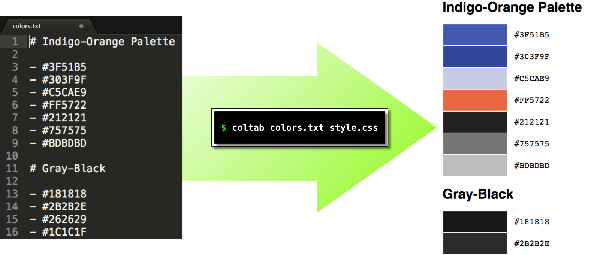

# coltab

Display your favourite RGB colours in HTML.

# Usage

## Input

1. A text file with Markdown-style headers and lists
2. A custom CSS file for styling the output HTML

## Output

An HTML file written to `stdout`.

# Notes

- For each list in the input file, `coltab` generates an HTML table with two columns:
    - Column 1: colours (`<td class="color">`)
    - Column 2: colour codes (`<td class="code">`)
- Valid list item values in input file include:
    - `RRGGBB`
    - `#RRGGBB`
    - `RGB`
    - `#RGB`
- The input file should be valid [Pandoc-flavoured Markdown](http://pandoc.org/MANUAL.html)
